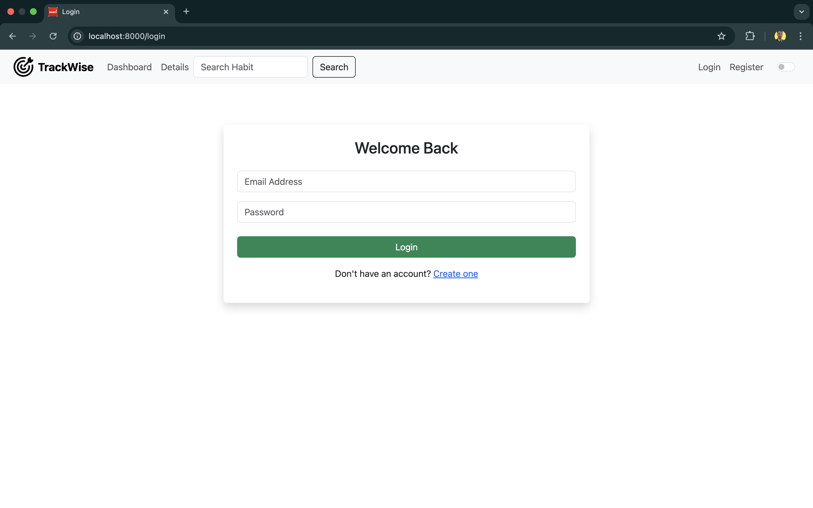
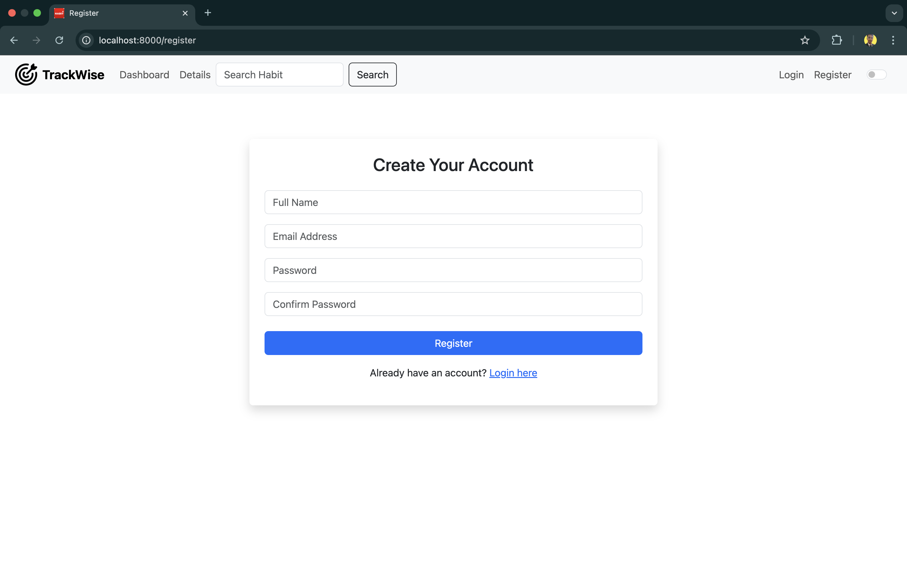
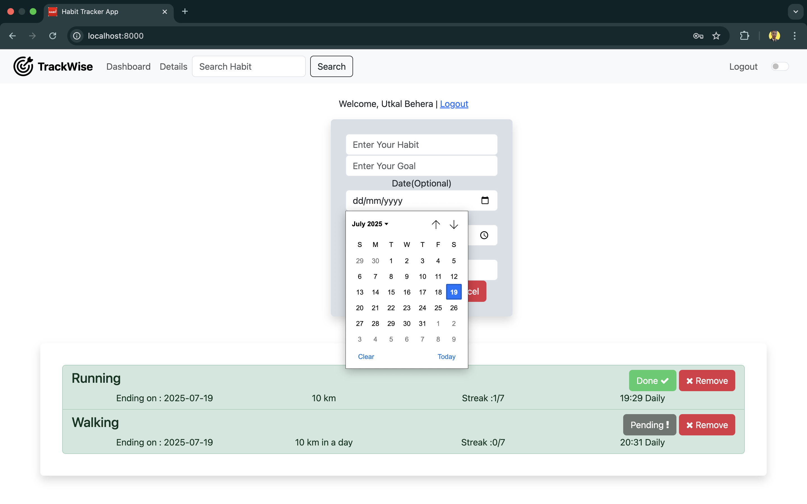
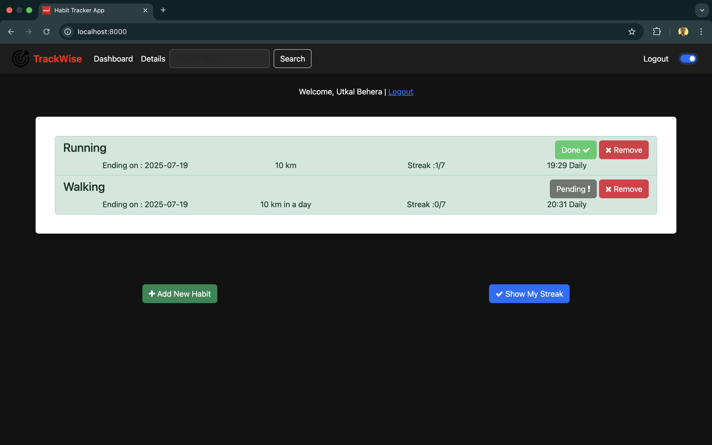
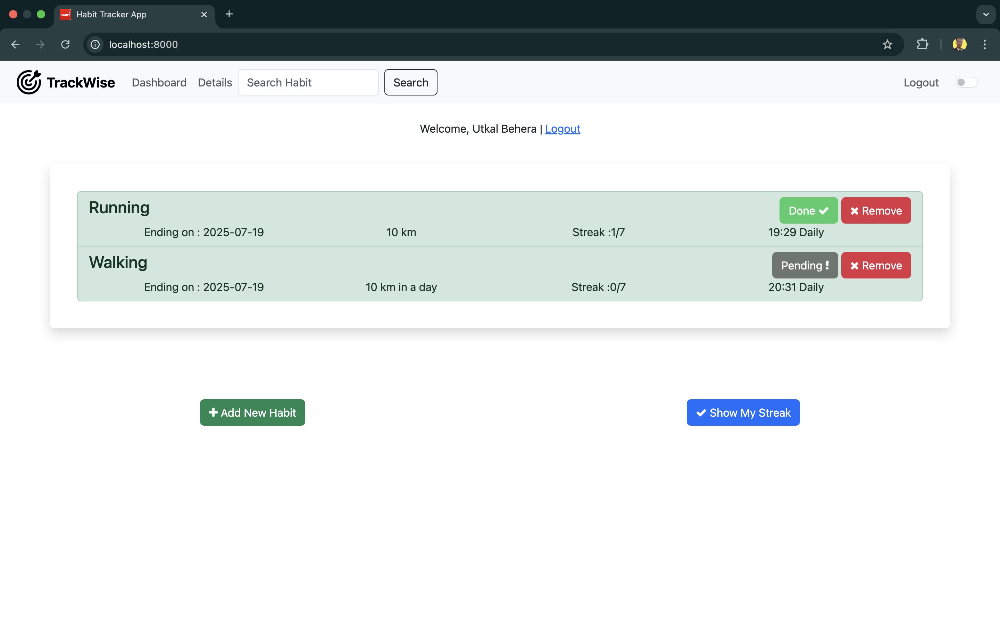

# TrackWise 🧠📅

**TrackWise** is a minimal and effective habit tracking web application that allows users to build positive routines by tracking daily habits. It includes user authentication, habit creation, calendar-based tracking, and progress visualization.

## 🔧 Tech Stack

-   **Frontend:** EJS (Embedded JavaScript Templates)
-   **Backend:** Node.js, Express.js
-   **Database:** MongoDB Atlas using Mongoose
-   **Architecture:** MVC (Model-View-Controller)
-   **Authentication:** Express Sessions (can be extended to use Passport.js or JWT)
-   **Styling:** Custom CSS, EJS templating

---

## ✨ Features

-   User registration and login
-   Create custom habits
-   Mark daily progress for each habit
-   Weekly calendar view for tracking
-   Add/delete habits
-   Dark mode toggle (UI feature)
-   Clean and responsive design

---

## 📁 Folder Structure

```

TrackWise/
├── assets/
│   ├── css/
│   │   ├── details.css
│   │   ├── home.css
│   │   └── layout.css
│   └── js/
│       ├── details.js
│       ├── home.js
│       ├── layout.js
│       └── moment.js
├── config/
│   └── mongoose.js
├── controllers/
│   ├── auth_controller.js
│   ├── details_controller.js
│   └── home_controller.js
├── middlewares/
│   └── auth.js
├── models/
│   ├── habits.js
│   └── user.js
├── node_modules/
├── routes/
│   ├── auth.js
│   ├── details.js
│   └── index.js
├── screenshots/
│   ├── CalenderView.png
│   ├── Darkmode.png
│   ├── Detailspage.png
│   ├── Homepage.png
│   ├── NewRegister.png
│   └── Streakpage.png
├── views/
│   ├── details.ejs
│   ├── home.ejs
│   ├── layout.ejs
│   ├── login.ejs
│   └── register.ejs
├── .env
├── .gitignore
├── index.js
├── package-lock.json
├── package.json
└── README.md


```

---

## 🚀 Getting Started

### Prerequisites

-   Node.js and npm installed
-   MongoDB Atlas account

### Setup Instructions

1. Clone the repo:

```bash
git clone https://github.com/Utkal9/TrackWise.git
cd TrackWise
```

2. Install dependencies:

```bash
npm install
```

3. Configure MongoDB:

Edit `config/mongoose.js` and replace the MongoDB URI with your MongoDB Atlas connection string.

4. Start the server:

```bash
npm start
```

5. Open your browser at:

```
http://localhost:8000
```

---

## 📸 Screenshots

### 🏠 Home Page



### 🔐 NewRegister Page



### ➕ Add Habit


### 📅 Weekly Calendar View



### 🌙 Dark Mode



### Details



---

## 👨‍💻 Author

**Utkal Behera**
[LinkedIn](https://www.linkedin.com/in/utkal-behera59/)
